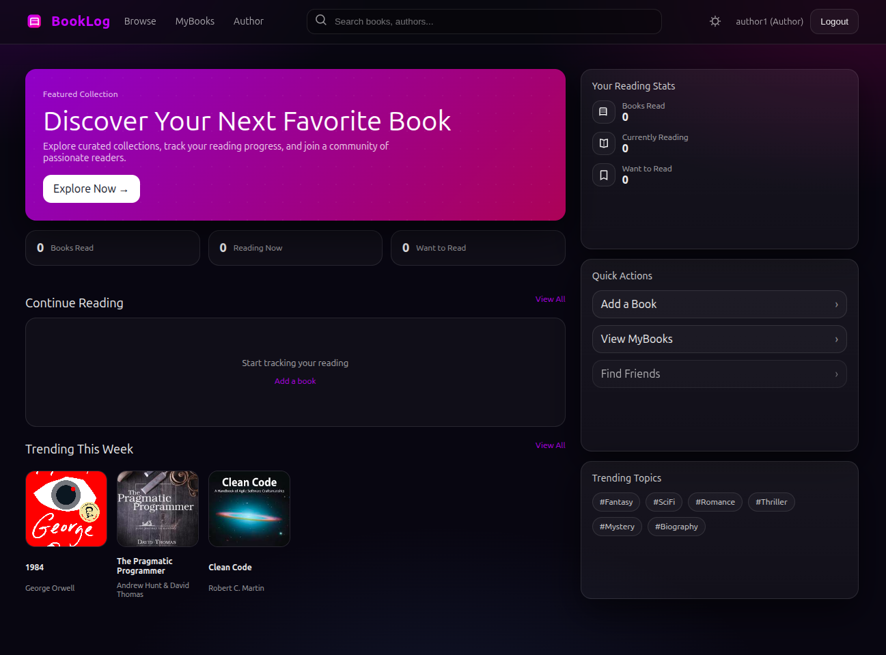
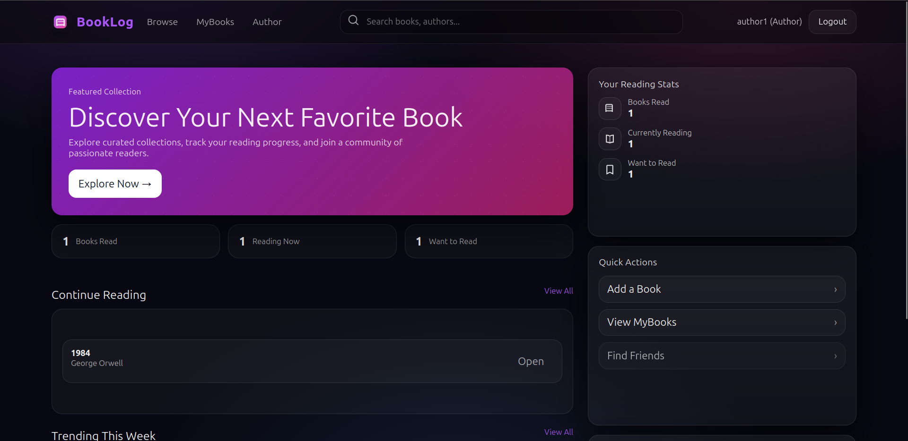

for cli commands 
https://angular.dev/cli/new 

Autocations 
https://github.com/CodAffection/Angular-User-Registration-with-.Net-Core-Web-API 


References
ASP.NET Core Identity Docs : https://bit.ly/465aJQi
I am using the ASPe.Net core identiti soulation 


IAM : https://bit.ly/468tIcN


ASP.NET Core Middlewares : https://bit.ly/4djwFtv
Authentication Standards : https://bit.ly/4dgMfWL




Main video 
https://www.youtube.com/watch?v=nanXE4BJ1wI&list=PLjC4UKOOcfDQtElvsn1ZCAHatLtqDrTgQ&index=2 


# BookLog (ITEP3200 Resit Web App)

BookLog is a web-based book review platform where users can browse books, maintain a personal reading list (MyBooks), and post comments on books. Authors and admins can create, update, and delete book records. The application is built as a .NET 8 Web API backend with a React (Vite) frontend.



---

## Tech Stack

### Backend
- .NET 8 Web API
- Entity Framework Core (SQLite)
- ASP.NET Core Identity (roles and users)
- JWT Bearer Authentication
- Static file hosting for uploaded book covers (`wwwroot/uploads`)
- Swagger / OpenAPI for API exploration

### Frontend
- React + TypeScript (Vite)
- Axios for HTTP requests
- React Router for client-side routing
- Custom auth context + protected routes

---

## Key Features

- Authentication with JWT tokens
- Role-based access control:
  - Admin: manage all books and moderate (delete) comments
  - Author: create/update/delete own books
  - Reader: browse books, manage MyBooks, comment
- CRUD for books
- Comments on books
- MyBooks (WantToRead / Reading / Finished)
- Cover image upload for books (stored in backend `wwwroot/uploads`)

---

## Repository Structure

### Root (high-level)
- `BackEnd/BookLogApi/`  
  .NET Web API project (controllers, EF Core, Identity, JWT, SQLite)
- `FrontEnd/booklog-client/`  
  React client (pages, components, API modules, routing, auth context)

---

## Backend Structure (BackEnd/BookLogApi)

Typical layout:

- `Controllers/`
  - `BooksController.cs`  
    CRUD endpoints for books
  - `MyBooksController.cs`  
    Personal reading list endpoints (requires authentication)
  - `UploadsController.cs`  
    Upload endpoint for cover images (Admin/Author)
  - `CommentsController.cs` (present in project)  
    Comment endpoints (book comments + delete)

- `Data/`
  - `ApplicationDbContext.cs` (EF Core DbContext)
  - `Seed/DbSeeder.cs` (creates DB and seed roles/users)

- `Models/`
  - `Book.cs`, `Comment.cs`, `MyBook.cs`, `ApplicationUser.cs`
  - `Enums/` (visibility status, reading status)

- `DTOs/`
  - `Books/` (BookDto, CreateBookDto, UpdateBookDto)
  - `MyBooks/` (MyBookDto, SetMyBookStatusDto)
  - Auth DTOs (login/register responses)

- `Services/`
  - `JwtTokenService.cs` (JWT creation)

- `wwwroot/uploads/`
  - Storage folder for uploaded cover images

### Backend Runtime Behavior
- Database is SQLite.
- `Program.cs` runs migrations at startup and seeds roles/users:
  - EF Core migrations are applied automatically.
  - Seeder creates roles (Admin, Author, Reader) and any default accounts defined by `DbSeeder`.

---

## Frontend Structure (FrontEnd/booklog-client)

- `src/api/`
  - `http.ts`  
    Axios instance. Reads `VITE_API_BASE_URL` and attaches JWT token from `localStorage` to requests.
  - `authApi.ts`  
    Login/register requests.
  - `booksApi.ts`  
    Book CRUD requests.
  - `myBooksApi.ts`  
    MyBooks reading-status requests.
  - `commentsApi.ts`  
    Fetch/add/delete comments.
  - `uploadsApi.ts` (added for cover upload)  
    Multipart cover upload for Admin/Author.

- `src/context/`
  - `AuthContext.tsx`  
    Stores logged-in user and token, provides login/logout helpers.

- `src/router/`
  - `AppRouter.tsx`  
    Defines routes.
  - `ProtectedRoute.tsx`  
    Guards pages requiring auth/roles.

- `src/pages/`
  - `HomePage.tsx`  
    Landing page + trending section.
  - `BooksPage.tsx`  
    Browse/search/filter books.
  - `BookDetailsPage.tsx`  
    Single book view + comments.
  - `MyBooksPage.tsx`  
    Personal reading list.
  - `AdminBooksPage.tsx`  
    Admin book management UI.
  - `AuthorBooksPage.tsx`  
    Author book management UI.
  - `LoginPage.tsx`, `RegisterPage.tsx`
  - `NotFoundPage.tsx`

- `src/components/`
  - `NavBar.tsx`  
    Navigation + search suggestions.
  - `BookCard.tsx`  
    Book list card (supports cover images).
  - `BookForm.tsx`  
    Create/edit form (supports cover upload + preview).
  - `BookFilters.tsx`
  - `CommentList.tsx`, `CommentForm.tsx`

- `src/utils/`
  - `resolveAssetUrl.ts`  
    Converts `"/uploads/xyz.png"` into a usable URL (important when API base is absolute).

---

## Environment Configuration

### Frontend `.env`
The frontend reads the API base URL from:

- `FrontEnd/booklog-client/.env`
- `VITE_API_BASE_URL`

Example:
```env
VITE_API_BASE_URL=http://localhost:5040/api
```

## Authentication and Authorization

### JWT Token Storage

- On login/register, the backend returns a JWT.
- The frontend stores the token in:
  - `localStorage["booklog_token"]`
- Axios (`src/api/http.ts`) automatically sends:
  - `Authorization: Bearer <token>`

### Roles

- `Admin`
  - Full book management
  - Can delete any comment
- `Author`
  - Can create books
  - Can update/delete own books
- `Reader`
  - Can browse, manage MyBooks, and comment

---

## API Overview (Important Endpoints)

All endpoints are under the `/api` prefix.

### Auth

- `POST /api/auth/register`
  - Body:
    ```json
    { "username": "name", "password": "pass", "role": "Reader" }
    ```
  - Response includes token + user.

- `POST /api/auth/login`
  - Body:
    ```json
    { "username": "name", "password": "pass" }
    ```
  - Response includes token + user.

### Books (Public Read, Restricted Write)

- `GET /api/books`
  - Returns list of books (used for Browse + Home Trending)

- `GET /api/books/{id}`
  - Returns one book

- `POST /api/books` (Admin/Author)
  - Creates a book
  - Body example:
    ```json
    {
      "title": "Book title",
      "authorName": "Author",
      "genre": "Fantasy",
      "description": "Text",
      "status": "Published",
      "coverImageUrl": "/uploads/<file>.png"
    }
    ```

- `PUT /api/books/{id}` (Admin/Author; author must own the book unless Admin)
  - Updates a book

- `DELETE /api/books/{id}` (Admin/Author; author must own the book unless Admin)
  - Deletes a book

Notes:
- `status` values come from `BookVisibilityStatus` (commonly `Published` or `Hidden`)
- `coverImageUrl` is stored as a path (e.g., `"/uploads/..."`) and served as a static file

### MyBooks (Requires Auth)

- `GET /api/mybooks`
  - Returns the logged-in user’s reading list with embedded `BookDto`

- `PUT /api/mybooks/{bookId}`
  - Creates or updates the MyBook row
  - Body:
    ```json
    { "status": "Reading" }
    ```
  - `status` values: `WantToRead`, `Reading`, `Finished`

- `DELETE /api/mybooks/{bookId}`
  - Removes a book from MyBooks

### Comments

- `GET /api/books/{bookId}/comments`
  - Returns comments for the book

- `POST /api/books/{bookId}/comments` (Requires Auth)
  - Adds a comment
  - Body:
    ```json
    { "content": "My comment" }
    ```

- `DELETE /api/comments/{commentId}` (Admin, and possibly comment owner depending on backend rules)
  - Deletes a comment

### Uploads (Cover Images)

- `POST /api/uploads/cover` (Admin/Author)
  - Multipart form-data:
    - `file`: image file (jpg/png/webp)
  - Response:
    ```json
    { "url": "/uploads/<generated-name>.png" }
    ```

Uploaded images are saved to:
- `BackEnd/BookLogApi/wwwroot/uploads`

And served publicly by the backend as:
- `GET /uploads/<generated-name>.png`

---

## Cover Upload Flow (Frontend)

When creating/updating a book as Admin/Author:

1. User selects an image file in the book form.
2. Frontend previews the image locally using `URL.createObjectURL(file)`.
3. On save, frontend uploads the file to:
   - `POST /api/uploads/cover`
4. Backend returns:
   - `{ "url": "/uploads/<file>.png" }`
5. Frontend stores the returned URL on the book as `coverImageUrl`.
6. UI displays the cover by resolving it using:
   - `resolveAssetUrl("/uploads/<file>.png")`

---

## Common Troubleshooting

### Cover images not showing

- Verify `VITE_API_BASE_URL` points to the backend (including `/api`)
- Ensure backend has `app.UseStaticFiles()` enabled (it does in `Program.cs`)
- Confirm `/uploads/<file>` is reachable directly in the browser

### 401 Unauthorized on protected endpoints

- Confirm a JWT token exists in localStorage under `booklog_token`
- Confirm the Axios interceptor is adding the Authorization header
- Confirm your user role matches the endpoint requirement

---

## Notes for Further Development

- Add rating system (DB model + endpoints + UI) when ready.
- Improve search by adding server-side query params (e.g., `/api/books?query=...`) for large datasets.
- Add pagination for books and comments if the dataset grows.
- Add validation and better error messages on both frontend and backend.

---
